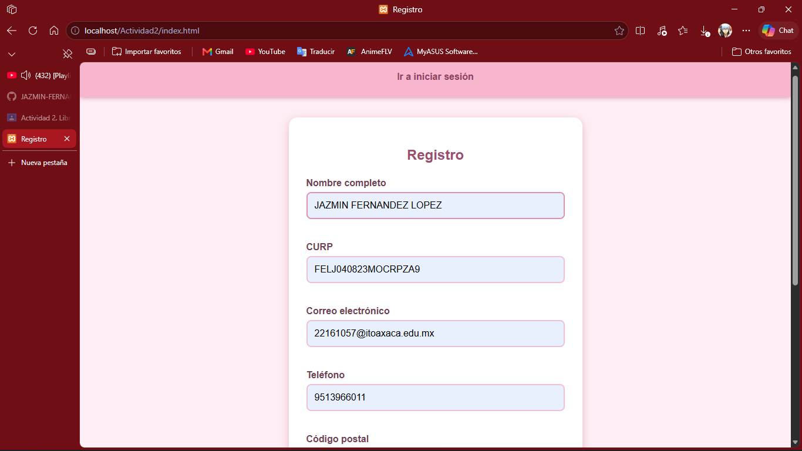
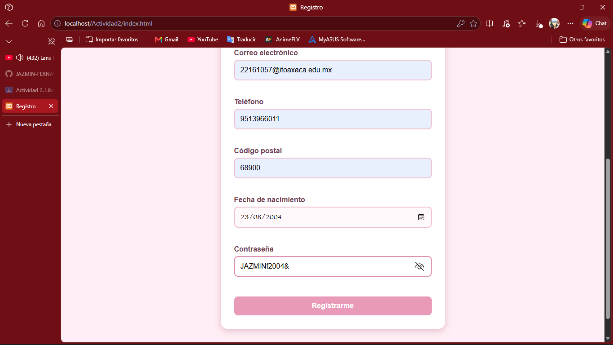
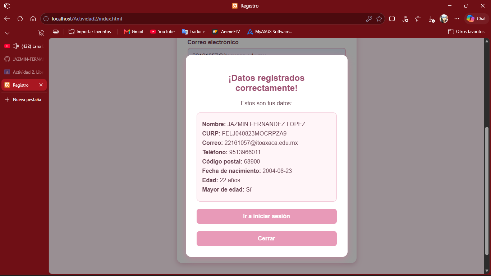
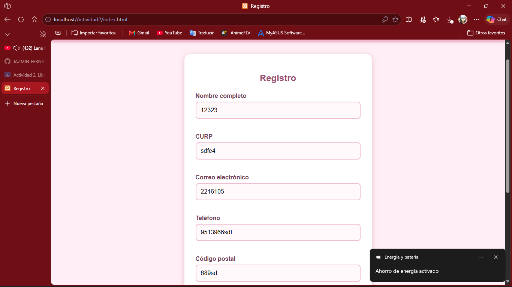
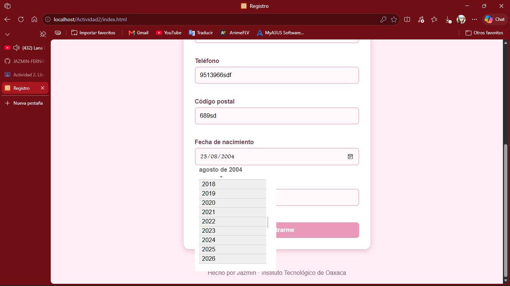
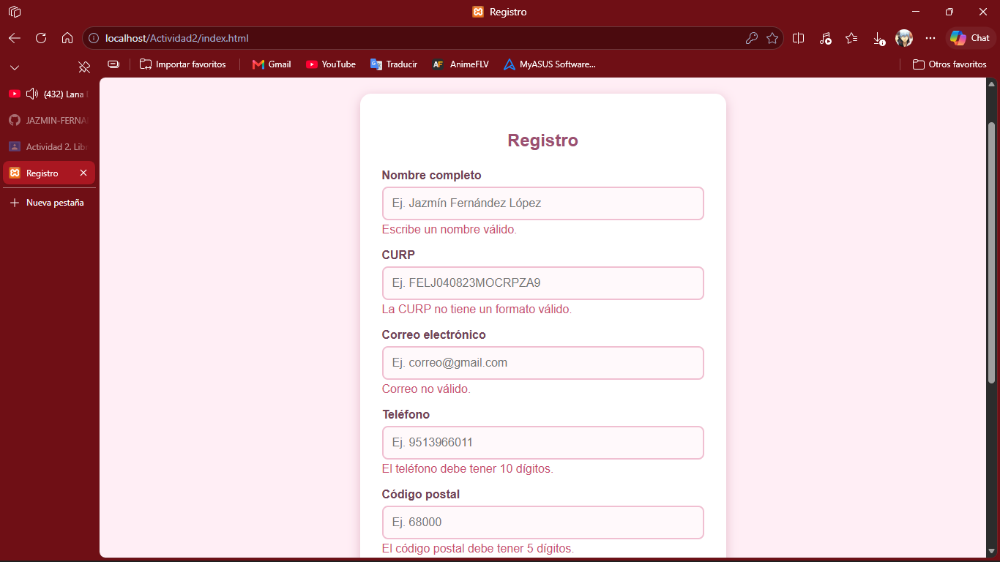
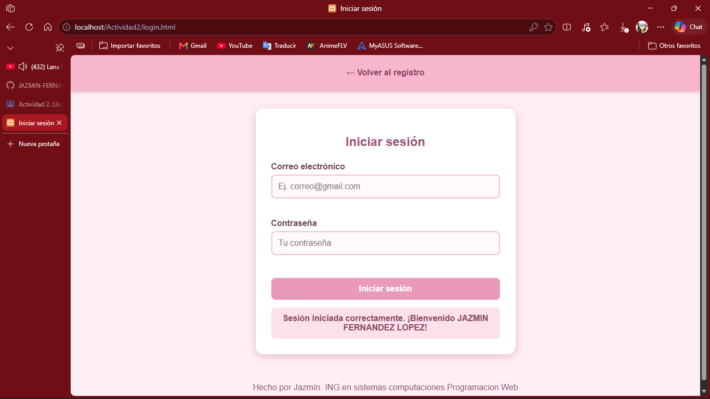

Nombre: Fernández López Jazmín
Carrera: ING en sistemas computacionales
Actividad2-Libreria utileria.js

¿Qué problema resuelve?

Fue creada para facilitar las validaciones de datos introducidos por los usuarios.

Se busca evitar que un formulario reciba informacion incorrecta, incompleta o con formato invalido.

No es necesario instalar frameworks ni librerias externas, el proyecto utiliza javaScript, HTML y CSS. Para utilizar la librería se debe incluir el archivo utileria.js dentro del documento HTML:

de igual manera los siguientes

En login.html:

Funciones obligatorias

1. validarCorreo(correo): esto nos ayuda a comprobar que el correo tenga la estructura basica de un correo valido, es decir, que tenga algo antes del simbolo @, por ejemplo .com.

function validarCorreo(correo) { 
    const formato = /^[\w.-]+@[\w.-]+\.[a-zA-Z]{2,}$/; return formato.test(correo); }

    Funciona de la siguiente forma
    const correo= "jazmin@gmail.com";
    luego valida y retorna true si esta bien, false si es incorrecto.

2. soloLetras(texto)
En esta funcion podemos comprobar que un texto tenga unicamente letras, acepta mayusculas, minusculas, vocales acentuadas, la letra Ñ y espacios y tambien permite validar nombres correctamente. da resultados de false o true, se ocupa para validar el campo de nombre

function soloLetras(texto) {
    const letras = /^[a-zA-ZáéíóúÁÉÍÓÚñÑ\s]+$/;
    return letras.test(texto);
}

3. validarLongitud(numero,maximo)

podemos comprobar que un numero no supere una cantidad determinada de caracteres, la usamos para validar el codigo postal, que solo es de 5

function validarLongitud(numero, maximo) {
    return String(numero).length <= maximo;
}

4. calcularEdad(fechaNacimiento)
calcula la edad de una persona utilizando su fecha de nacimiento
su uso es ejemplo
console.log(calcularEdad("2004-08-23"));
el resultado depende de la fecha en la que se ejecute, ya que compara la fecha de nacimiento con la fecha actual del sistema
la funcion obtiene el resultado cuando el usuario termina el registro y la edad calculada se muestra dentro de la ventana modal

function calcularEdad(fechaNacimiento) {
    const nacimiento = new Date(fechaNacimiento);
    const hoy = new Date();

    let edad = hoy.getFullYear() - nacimiento.getFullYear();

    if (hoy.getMonth() < nacimiento.getMonth() || (hoy.getMonth() == nacimiento.getMonth() && hoy.getDate() < nacimiento.getDate())) {
        edad--;
    }

    return edad;
}

5. esMayorDeEdad(fechaNacimiento)
Esta funcion indica si una persona es mayor o menor de edad. utiliza calcularEdad() para obtener la edad y devuelve true si es mayor o igual a 18 años. La restriccion de que no se puedan elegir fechas futuras en el calendario no la hace esta funcion, esa validacion se hace desde el HTML con el input de tipo fecha.

function esMayorDeEdad(fechaNacimiento) {
    return calcularEdad(fechaNacimiento) >= 18;
}

6. validarPassword(password)
comprueba que la contraseña tenga los requisitos minimos que son
una letra mayuscula
una letra minuscula
un numero
un caracter especial
minimo 8 caracteres

function validarPassword(password) {
    const formato = /^(?=.*[a-z])(?=.*[A-Z])(?=.*\d)(?=.*[^\w\s]).{8,}$/;
    return formato.test(password);
}

7. validarCURP(curp)
valida que una curp cuente con la estructura valida. primero convierte la curp en mayusculas y despues utiliza una expresion regular para comprobar su formato, revisando cosas como la fecha de nacimiento, si es hombre o mujer y la parte final de la curp, evitando asi una curp mal escrita

function validarCURP(curp) {
    curp = curp.toUpperCase();

    const formato = /^[A-Z][AEIOU][A-Z]{2}\d{6}[HM][A-Z]{5}[A-Z0-9]\d$/;

    return formato.test(curp);
}

8. guardarDatos(datos)
permite guardar datos del usuario en el almacenamiento local del navegador mediante localStorage

function guardarDatos(datos) { localStorage.setItem("usuario", JSON.stringify(datos)); }

Después de registrar un usuario, sus datos se almacenan en el navegador y el login puede comprobar si el correo y la contraseña introducidos coinciden con los datos registrados.

9. formatearTelefono(telefono)
Da formato al número de teléfono, separándolo en bloques (XXX-XXX-XXXX) para mostrarlo de forma más legible en el modal de datos registrados.

function formatearTelefono(telefono) {
    return telefono.substring(0, 3) + "-" + telefono.substring(3, 6) + "-" + telefono.substring(6, 10);
}

Cuando el usuario presiona el botón Registrarme, JavaScript obtiene los valores de los campos y utiliza las funciones de utileria.js.

if (!validarCorreo(correo.value)) {
    document.getElementById("errorCorreo").textContent =
        "Correo no válido.";

    correo.value = "";
}

También se utiliza:

if (!validarCURP(curp.value)) {
    document.getElementById("errorCurp").textContent =
        "La CURP no tiene un formato válido.";

    curp.value = "";
}

y en el modal, cuando todos los datos son correctos, se calcula la edad y se muestra la informacion

El login utiliza las funciones de validar correo y validar password, luego recupera los datos guardados con localStorage y los convierte nuevamente en objeto para comprobar que la contraseña sea correcta con lo del registro

CAPTURAS DE PANTALLA DEL FUNCIONAMIENTO

### Formulario de registro vacio

### Registrando datos en el formulario

### boton registrar

### Prueba con datos incorrectos

### calendario

### validaciones

### inicio de sesion
